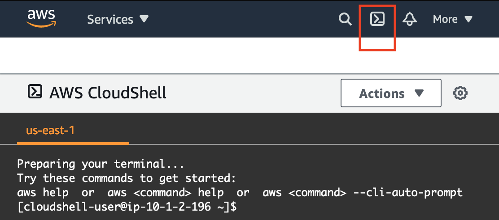

<link rel="stylesheet" href="https://use.fontawesome.com/releases/v5.11.2/css/all.css">

# Learner Lab - Foundational Level
<a href="#envOverview">Environment Overview</a><br>
<a href="#envNav">Environment Navigation </a><br>
<a href="#mgmtConsole">Access the AWS Management Console </a><br>
<a href="#regionRest">Region restriction </a><br>
<a href="#services">Service usage and other restrictions </a><br>
<a href="#terminal">Using the terminal in the browser </a><br>
<a href="#clicommands">Running AWS CLI commands </a><br>
<a href="#sdk">Using the AWS SDK for Python </a><br>
<a href="#ec2">Accessing EC2 Instance(s) </a><br>
<a href="#ssh">SSH Access to EC2 Instances </a><br>
<a href="#sshwindows">SSH access from Windows</a><br>
<a href="#sshmac">SSH access from a Mac</a>


### <a id="envOverview"></a>Environment Overview

<i class="fas fa-exclamation-triangle" style="color:red"></i> We have discovered a security vulnerability in AWS Academy Learner Labs. To protect you and your students, we have temporarily updated the lab policy applied to Learner Labs to prevent misuse. We have a team working on designing a solution that prevents this exploit while retaining your flexibility to use Learner Labs. While we are working on this, some features may not work as published. We will provide an update as soon as we have a resolution in place. Thank you for your patience.  As always, if you need support reach out to us at support@awsacademy.com.

This Learner Lab provides a sandbox environment for ad-hoc exploration of AWS services.

**This environment is long-lived**. When the session timer runs to 0:00, the session will end, but any data and resources that you created in the AWS account will be retained. Running resources (such as an EC2 instance) may be stopped. If you later launch a new session (for example, the next day), you will find that your work is still in the lab environment. However, you may need to manually start any stopped resources.

<i class="fas fa-exclamation-triangle" style="color:red"></i> **IMPORTANT**: Monitor your lab budget in the lab interface above. Whenever you have an active lab session, the latest known remaining budget information will display at the top of this screen. This data comes from AWS Budgets which typically updates every 8 to 12 hours. Therefore *the remaining budget that you see may not reflect your most recent account activity*.  **<u>If you exceed your lab budget your lab account will be disabled and all progress and resources will be lost</u>**. Therefore, it is important for you to manage your spending. *Suggestions to avoid overspending*: Launch only the number of instances you need, sized to your requirements. Stop EC2 and RDS instances when not in use. Delete no longer needed resources and data.


### <a id="envNav"></a>Environment Navigation

Use the <i class="fas fa-info"></i> **Readme** link above to return to these instructions at any time.

Use the <i class="fas fa-info"></i> **AWS Details** link above to access information about your environment.

After you start the lab, the AWS Details panel will display and you will need to choose **Readme** to return to these instructions.

<i class="fas fa-check-circle"></i> **Tip:** you can resize this panel at anytime by dragging the bar to the left of these instructions to make it wider or narrower.

Use the <i class="fas fa-undo"></i> **Reset** link above if you ever want to reset your AWS account back to the way it was in the beginning, before you ever ran sessions of this lab environment.  <i class="fas fa-exclamation-triangle" style="color:red"></i> ***CAUTION***: if you choose reset and then choose Yes to confirm that you do want to reset, you will *permanently delete* everything that you have created or stored in the AWS account.

The terminal window to the left of these instructions can be used to run AWS CLI commands or code such as AWS SDK for Python code (details provided below).


### <a id="mgmtConsole"></a>Access the AWS Management Console

1. At the top of these instructions, choose <br/> <i class="fas fa-caret-right"></i> **Start Lab** to start the lab session.

    - The lab session is started and session information is displayed.

    - A timer above shows the time remaining in the session.

	  <i class="fas fa-check-circle"></i> **Tip:** You can refresh the session length at any time by choosing Start Lab again before the timer reaches 0:00.

2. Choose the <i class="fas fa-info"></i> Readme link to return to these instructions.

3. Connect to the AWS Management Console by choosing the **AWS** link above the terminal window.

    - You should be connected to the AWS Management Console.

      **Tip**: If a new browser tab does not open, a banner or icon is usually at the top of your browser with the message that your browser is preventing the site from opening pop-up windows. Choose the banner or icon, and then choose **Allow pop-ups**.

      <i class="fas fa-info-circle"></i> **Tip**: if you are interested in interacting with the AWS account programmatically, read the <a href="#terminal">Configuring and using the terminal in the browser</a> section below for details.


## <a id="regionRest"></a>Region restriction
All service access is limited to the **us-east-1** and **us-west-2** Regions. If you load a service console page in another AWS Region you will see access error messages.


## <a id="services"></a>Service usage and other restrictions
The following services can be used. Specific limitations apply as documented.  Services restrictions are subject to change.

  * Application Auto Scaling
  * Amazon Aurora
  * AWS Cloud9
        * Supported Instance types: nano, micro, small, medium, large, and c4.xlarge.
  * AWS CloudFormation
  * Amazon CloudFront
  * AWS CloudShell
  * AWS CloudTrail
  * Amazon CloudWatch
  * AWS CodeCommit
  * Amazon Cognito
  * Amazon Comprehend
  * AWS DeepRacer
  * Amazon DynamoDB
  * Amazon EC2 Auto Scaling
        * Supported Instance types: nano, micro, small, medium, and large.
        * Maximum of 32 vCPU used by concurrently running instances in an AWS Region. For example, t2.micro instances use 1 vCPU each, so you could run up to 32 of them. However,  t3.large instances use 2 vCPUs each, so you can run up to 16 of them. You can run a mix of instance types as long as you do not exceed the 32 vCPU threshold. Note that you are also limited to launching no more than nine (9) instances (of any size) in a Region at once. *Recommendation*: size  to your actual need to avoid using up your cost budget.
  * AWS Elastic Beanstalk
        - Supported Instance types: nano, micro, small, medium, and large. If you attempt to launch a larger instance type, it will be terminated.
        - When you first create an environment in the console, it will use the default security settings. However after the environment has been created, you may want to edit the configuration's security settings. Change the service role to **LabRole**. Similarly, set the IAM instance profile to **LabInstanceProfile**. If the environment is in the us-east-1 AWS Region, you could set the EC2 key pair to **vockey**.  These settings will give you more permissions than the defaults.
  * Amazon Elastic Block Store (EBS)
        - Maximum volume size is 100GB
        - PIOPs not supported
  * Amazon Elastic Compute Cloud (EC2)
        - Supported AMIs: AMIs where the owner is Amazon.
            - To launch a ***Windows*** or ***Amazon Linux*** instance: Choose "Launch Instances", then choose from the ones available in the "Quick Start" tab.
            - To launch an ***Ubuntu*** instance: In the EC2 Console, choose AMIs (on the left), change the dropdown next to the search bar to "Public Images", click in the search bar and choose "Owner", then choose "Amazon images". Choose Add filter in the search bar again and choose "Source", then type in "amazon/Cloud9Ubuntu". Any of the AMIs in the result set should be launchable (tip: sort by AMI Name to see the latest). Choose the checkbox next to one and select Launch. Finally, login as the ubuntu user. For example, run this command in the terminal to the left of these instructions, where public-ip is the actual public IP address: `ssh -i ~/.ssh/labsuser.pem ubuntu@public-ip`.
            - To launch a ***C******entOS*** instance: follow the same steps as documented above for launching an Ubuntu instance, however, set the "Source" filter to "amazon/CentOS" (or for newer images set "Source" to "amazon/aws-parallelcluster-2". Connect using SSH as the *centos* user. Tip: run `sudo yum update -y` after connecting, to apply the latest updates.
            - To launch a ***RHEL*** instance: follow the same steps as documented above for launching an Ubuntu instance, however, set the "Source" filter to  "amazon/RHEL". Tip: the Red Hat AMIs with SQL express have lesser instance size requirements (for example, can as a t2.medium). Connect using SSH as *ec2-user*.
        - Supported Instance types: nano, micro, small, medium, and large.
        - Instance quantity -  Maximum of 32 vCPU used by concurrently running instances in an AWS Region. For example, t2.micro instances use 1 vCPU each, so you could run up to 32 of them. However,  t3.large instances use 2 vCPUs each, so you can run up to 16 of them. You can run a mix of instance types as long as you do not exceed the 32 vCPU threshold. Note that you are also limited to launching no more than nine (9) instances (of any size) in a Region at once. *Recommendation*: size  to your actual need to avoid using up your cost budget.
        - On-Demand instances only
        - EBS volumes - sizes up to 100 GB and type must be General Purpose SSD (`gp2`, `gp3` ) cold HDD (`sc1`), or standard.
        - Key pairs - If you are creating an EC2 instance in any AWS Region other than us-east-1, the vockey key pair will not be available. In such cases, you should create a new key pair and download it when creating the EC2 instance. Then use the new key pair to connect to that instance.
        - A role named **LabRole** and an instance profile named **LabInstanceProfile** have been pre-created for you. You can attach the role (via the instance profile) to an EC2 instance when you want to access an EC2 instance (terminal in the browser) using AWS Systems Manager Session Manager. The role also grants permissions to any applications running on the instance to access many other AWS services from the instance.
        - **Tip**: to preserve your lab budget, stop any running EC2 instances before you are done using the account for the day (or terminate them if not longer needed). When your session ends, the lab environment *may* place any running instances into a 'stopped' state. Keep this in mind when you start a new session, that you may need to start the stopped instance(s). Also, instances that have been stopped and started again, will be assigned a new IPv4 public IP address unless you have an elastic IP address associated with the instance.
  * Amazon Elastic Container Registry (ECR)
  * Amazon Elastic File System (EFS)
  * Amazon Elastic Inference
  * Elastic Load Balancing
  * Amazon EventBridge
  * Amazon Forecast
  * AWS Glue
  * AWS Glue DataBrew
  * AWS Identity and Access Management (IAM)
        - Extremely limited access. You cannot create users or groups. You cannot create roles, except that you can create service-linked roles.
        - Service role creation is generally permitted. If the service needs to create a role for you, you may need to retry role creation if it fails the first time.
        - A role named **LabRole** has been pre-created for you. This role is designed to be used when you want to attach a role to a resource in an AWS service. It grants many AWS services access to other AWS services and has permissions very similar to the permissions you have as a user in the console.  
          - Example use: attach the LabRole via the instance profile named **LabInstanceProfile** to an EC2 instance for terminal in the browser access to an EC2 instance guest OS using AWS Systems Manager Session Manager.
          - Another example: Attach the LabRole to a Lambda function so that the Lambda function can access S3, CloudWatch, RDS, or some other service.
          - Another example: Attach the LabRole to a SageMaker notebook instance so that the instance can access files in an S3 bucket.
  * AWS Key Management Service (KMS)
  * AWS Lambda
        * **Tip**: Attach the existing **LabRole** to any function that you create if that function will need permissions to interact with other AWS services.
  * Amazon Lex
  * Amazon Lightsail
        * If you choose  vCPU and memory specs that are too high (such as as 8 vCPU and 32GB) the instance may be terminated. Smaller sizes are supported.
  * Amazon Marketplace Subscriptions (Amazon ML)
        - Extremely limited read-only access.
  * Amazon Polly
  * Amazon Rekognition
  * Amazon Relational Database Service (RDS)
        - Supported instance types: nano, micro, small, and medium.
        - Supported database engines: Amazon Aurora, MySQL, PostgreSQL and MariaDB.
        - EBS volumes - size up to 100 GB and type General Purpose SSD (gp2).
        - On-Demand DB instance class types only
        - Multi-AZ deployments are not supported (choose Dev/Test or Free tier template if prompted and do not create a standby instance).
        - Enhanced monitoring is not supported (you must *uncheck* this default setting).
        - Tip: to preserve your lab budget, stop any running RDS instances before you are done using the account for the day (or terminate them if not longer needed). Be aware that if you do stop an RDS instance and leave it stopped for seven days, AWS will start it again automatically, which will increase the cost impact.
  * AWS Resource Groups & Tag Editor
  * AWS RoboMaker
        * Supported Instance types for development environments: *nano*, *micro*, *small*, *medium*, *large*, and *c4.xlarge* only.
  * Amazon SageMaker
        - Supported instance types: *medium*, *large*, and *xlarge* only.
        - GPU instance types are not supported.
  * AWS Secrets Manager
  * AWS Security Token Service (STS)
  * AWS Service Catalog
  * Amazon Simple Notification Service (SNS)
  * Amazon Simple Queue Service (SQS)
  * Amazon Simple Storage Service (S3)
  * Amazon Simple Storage Service Glacier (S3 Glacier)
        - You cannot create a vault lock
  * AWS Step Functions
  * AWS Systems Manager (SSM)
        * A role named **LabRole** and an instance profile named **LabInstanceProfile** have been pre-created for you. You can attach the role (via the instance profile) to an EC2 instance when you want to access an EC2 instance (terminal in the browser) using AWS Systems Manager Session Manager.
  * Amazon Textract
  * Amazon Translate
  * AWS Trusted Advisor
  * Amazon Virtual Private Cloud (Amazon VPC)
  * AWS Well-Architected Tool


## <a id="terminal"></a>Using the Terminal in the browser

A terminal window displays to the left of these instructions. The terminal provides access to a Linux shell on a server that exists *outside* of the AWS account that you use when your lab is running. Credentials are configured on the server that provide the same level of AWS service access via the terminal that you also have via the AWS Management Console.

<i class="fas fa-info-circle"></i> Tip**: A simple alternative to using this terminal in the browser is to use AWS CloudShell. You can access it in the AWS Management Console, at the top of the screen, by choosing the **AWS CloudShell** icon (highlighted in red in the screen capture below).




### <a id="clicommands"></a>Running AWS CLI commands

Here is an example AWS CLI command to try running in the terminal. If you have created any EC2 instances in the default account Region, running this command will provide information about them:

```bash
aws ec2 describe-instances
```

See the <a href="https://docs.aws.amazon.com/cli/latest/reference/" target=_blank>AWS CLI Command Reference</a> documentation for details on how to use the AWS CLI.


### <a id="sdk"></a>Using the AWS SDK for Python

The terminal also has Python 3 installed with the boto3 library available. You can use it to run AWS Python SDK code. For example:

```python
$ python3
>>> import boto3
>>> ec2 = boto3.client('ec2', region_name='us-east-1')  
>>> ec2.describe_regions()
>>> exit()
$
```
See the <a href="https://boto3.amazonaws.com/v1/documentation/api/latest/index.html" target=_blank>documentation</a> for details on how to use the AWS SDK for Python.


## <a id="ec2"></a>Accessing EC2 Instance(s)

When launching EC2 instances in the default us-east-1 Region in this environment, choose the option to use the existing key pair named ***vockey*** at the time of launch.  Then:

  * Choose the <i class="fas fa-info"></i> **AWS Details** link above these instructions.

    * If you are using a Windows desktop or laptop, choose the **Download PPK** button and save the **labsuser.ppk** file. You can use this file to connect via SSH to a Linux EC2 instance or Windows EC2 instance, typically using a tool such as PuTTY.
    * If you are using a MacOS desktop or laptop, choose the **Download PEM** button and save the **labsuser.pem** file. You can use this file to connect via SSH to a Linux EC2 instance or Windows EC2 instance, typically using a terminal window.

* **To connect via Remote Desktop to a Windows EC2 instance**:

    * In the EC2 Console, choose **Instances** and choose the instance you want to connect to
    * From the **Actions** menu choose **Get Windows Password**
    * Next to *Key Pair Path* choose **Browse**.
    * Browse to and select the labsuser.pem file you downloaded earlier.
    * Choose **Decrypt Password**.
    * The connection information will now display, including the instance's Public DNS, Administrator user name, and the decrypted password.
    * Use a Remote Desktop Protocol (RDP) client to connect to the desktop of the EC2 instance using these connection details.

    * **To connect using SSH to a Linux instance, see the next section**.


## <a id="ssh"></a>SSH access to an EC2 Instance you launch

The steps below describe how to use the SSH key to connect to your instance.  

**Tip**: Assuming you launched the instance with the vockey key pair, and that you have opened TCP port 22 in the instance's security group, you can also SSH to an EC2 instance by using the terminal to the side of these instructions. The terminal already has the key pair available to it. Simply enter the command `ssh -i ~/.ssh/labsuser.pem ec2-user@<public-ip>` where `<public-ip>` is the actual IPv4 public address of the instance.

### <a id="sshwindows"></a><i class="fab fa-windows"></i> Windows Users: Using SSH to Connect

<i class="fas fa-comment"></i> These instructions are for Windows users only.

1. Download needed software.

    * You will use **PuTTY** to SSH to Amazon EC2 instances. If you do not have PuTTY installed on your computer, <a href="https://the.earth.li/~sgtatham/putty/latest/w64/putty.exe">download it here</a>.

2. Open **putty.exe**

3. Configure PuTTY to not timeout:

    * Choose **Connection**
    * Set **Seconds between keepalives** to `30`

    This allows you to keep the PuTTY session open for a longer period of time.

4. Configure your PuTTY session:

    * Choose **Session**

    * **Host Name (or IP address):** Copy and paste the **IPv4 Public IP address** for the instance. To find it, return to the EC2 Console and choose **Instances**. Check the box next to the instance and in the *Description* tab copy the **IPv4 Public IP** value.

    * Back in PuTTy, in the **Connection** list, expand <i class="far fa-plus-square"></i> **SSH**

    * Choose **Auth** (don't expand it)

    * Choose **Browse**

    * Browse to and select the .ppk file that you downloaded

    * Choose **Open** to select it

    * Choose **Open**

5. Choose **Yes**, to trust the host and connect to it.

6. When prompted **login as**, enter: `ec2-user`

    This will connect you to the EC2 instance.


### <a id="sshmac"></a>macOS <i class="fab fa-apple"></i> and Linux <i class="fab fa-linux"></i> Users - Using SSH to Connect

These instructions are for Mac/Linux users only.

1. Read through the two bullet points in this step before you start to complete the actions, because you will not be able see these instructions when the AWS Details panel is open.

    * Choose the <i class="fas fa-info"></i> **AWS Details** link above these instructions.

    * Choose the **Download PEM** button and save the **labsuser.pem** file.

      Typically your browser will save it to the Downloads directory.

2. Open a terminal window, and change directory `cd` to the directory where the .pem file was downloaded.

    For example, run this command, if it was saved to your Downloads directory:

    ```plain
    cd ~/Downloads
    ```

3. Change the permissions on the key to be read only, by running this command:

    ```plain
    chmod 400 labsuser.pem
    ```

4. Return to the AWS Management Console, and in the EC2 service, choose **Instances**.

    Check the box next to the instance you want to connect to.

5. In the *Description* tab, copy the **IPv4 Public IP** value.

6. Return to the terminal window and run this command (replace **<public-ip\>** with the actual public IP address you copied):

    ```plain
    ssh -i <filename>.pem ec2-user@<public-ip>
    ```

7. Type `yes` when prompted to allow a first connection to this remote SSH server.

    Because you are using a key pair for authentication, you will not be prompted for a password.
